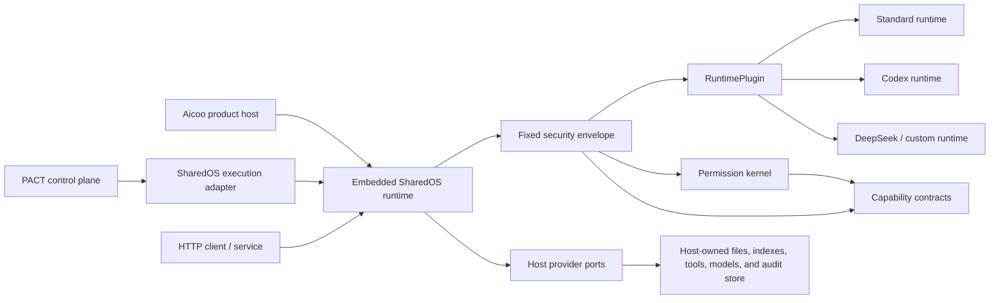

# SharedOS

SharedOS is a **permission-controlled state and delegation kernel with a
pluggable execution layer for agents**. It lets agents communicate, access
files, and invoke built-in or external tools without allowing a message—or a
model—to grant itself authority.

SharedOS is more than a messaging protocol. It provides the reusable execution
and authorization layer beneath products such as Aicoo and experiment systems
such as PACT.

> **Project status:** initial architecture and contracts are under active
> development. SharedOS is distributed as a `0.x` prerelease under npm's
> `next` tag; the API is not stable or production-hardened yet.

## Why SharedOS is more than messaging

Cross-boundary agent requests ultimately target state: facts to retrieve, state
changes to perform, or understanding to carry into future work. That state has
two operational forms:

| Access surface   | What it represents                                                                        | SharedOS control                                                  |
| ---------------- | ----------------------------------------------------------------------------------------- | ----------------------------------------------------------------- |
| Knowledge access | Accumulated understanding such as project context, identity, decisions, plans, and memory | `files` capabilities over explicit paths and actions              |
| Live tool access | Transient state and external side effects such as calendar, email, APIs, records, and MCP | Tool namespace enablement plus exact resource/action capabilities |

Transient information must be observed at request time. Calendar availability,
inbox contents, and the current status of an external record remain behind live
tools because a copied answer can immediately become stale. Accumulated
understanding is different: it develops across interactions and should remain
inspectable, searchable, editable, snapshotable, and governable.

SharedOS therefore adopts **file-as-memory** for accumulated understanding.
Memory is not a second opaque store with separate authority. It is a role over
authorized files, and agents are expected to distill knowledge into the file
tree. Memory, workspace, identity, history, and curated knowledge can occupy
different paths or mounted views, but they retain one file identity and one
permission model. Derived indexes and context mounts must preserve the grants
of their source files.

A live tool result becomes durable SharedOS knowledge only when an agent
distills it into a file. Reading the source tool and creating, replacing, or
appending that file are separate permission decisions; authority does not
transfer implicitly between them.

This gives every agent relationship two independently partitionable capability
sets:

1. **File capabilities:** which accumulated knowledge the other agent may list,
   search, read, create, replace, append, delete, or snapshot.
2. **Tool capabilities:** which live systems, accounts, resources, and actions
   the other agent may use. Tool namespace selection is an additional coarse
   availability gate, never authority by itself.

A colleague can therefore search one project subtree and read only calendar
free/busy information without seeing personal knowledge or sending email. A
different delegate can share the same files while receiving a narrower—or
broader—tool surface. Messages coordinate the work, but they grant neither kind
of access.

## What belongs in SharedOS

- A deny-by-default permission kernel based on explicit capability grants.
- Structured agent identities, addresses, messages, namespaces, and traces.
- Agent-to-agent request and response dispatch.
- A canonical `files` resource contract, including deterministic operations
  such as list, read, search, grep, create, replace, append, delete, and snapshot.
- A registry for built-in OS capabilities and host-provided external or MCP
  tools.
- A default-off tool namespace control plane with context-specific catalogs,
  host-owned settings, and discovery/invocation enforcement.
- One permission-controlled agent turn, with a standard runtime, a replaceable
  runtime-plugin contract, provenance, and audit events.
- Equivalent embedded-library and HTTP client boundaries over the same
  contracts.

SharedOS owns the **semantics and enforcement** of file capabilities. The host
owns the files, notes, folders, indexes, embeddings, credentials, and lifecycle.
Memory is a role or mounted view of authorized files, never a second authority
or storage namespace.

SharedOS deliberately does not own product UI, accounts, billing, benchmark
tasks, gold labels, evaluators, or multi-tick experiment scheduling.

## Architecture at a glance



The dependency direction is always:

```text
Aicoo / PACT / another host  ->  SharedOS contracts and runtime
SharedOS                    -X->  host product internals
```

The SharedOS core must not import Next.js, Drizzle, Azure, Aicoo credits, or
PACT tasks, gold data, runners, and evaluators.

Read the practical [host integration guide](docs/host-integration.md), the
generated [package API reference](docs/api/README.md), the complete
[architecture](docs/architecture.md),
[permission model](docs/security/permission-model.md), and
[threat model](docs/security/threat-model.md).

## Packages

| Package                       | Responsibility                                                  |
| ----------------------------- | --------------------------------------------------------------- |
| `@aicoo/sharedos-contracts`   | JSON-safe protocol types, schemas, and stable identifiers       |
| `@aicoo/sharedos-core`        | Deterministic authorization, routing, and dispatch decisions    |
| `@aicoo/sharedos-os`          | Standard `files` operations and guarded OS tools                |
| `@aicoo/sharedos-runtime`     | Fixed turn envelope, standard runtime, and plugin contract      |
| `@aicoo/sharedos-client`      | Typed client for a remote SharedOS HTTP boundary                |
| `@aicoo/sharedos-http`        | Transport adapter over the same runtime and contracts           |
| `@aicoo/sharedos`             | One-install entry point re-exporting the production packages    |
| `@aicoo/sharedos-testkit`     | In-memory providers and conformance helpers for tests           |
| `@aicoo/sharedos-conformance` | Standard execution records and adversarial conformance evidence |
| `@aicoo/sharedos-adapters`    | Codex and Claude Code runtime adapters                          |

`testkit` is not a production persistence layer. Production state remains in
the host.

## Pluggable runtimes

SharedOS is runtime-agnostic, not runtime-less. `@aicoo/sharedos-runtime` ships
`StandardRuntime`, a bounded reference loop over `AgentTurnDriver`, while
`RuntimePlugin` allows a host to install a complete Codex, DeepSeek, or custom
harness.

Everything above the security kernel may vary: model/provider adapters, agent
loops, prompt and context strategy, stopping logic, session implementation, and
execution backend. The security envelope does not vary. It admits the target
agent, exposes only the effective tool catalog, withholds grants and issuing
authority, re-authorizes every exact tool call, wraps runtime events, applies
the deadline, and records the runtime id and version in the result.

Runtime selection comes from trusted host configuration, never from a message
or model-authored request field. An in-process plugin is trusted host code; an
untrusted harness belongs in a sandbox or remote process connected through the
same capability-broker boundary.

## Integration modes

**Embedded library — recommended for Aicoo.** Aicoo keeps authentication,
billing, UI, and its existing persistence. It implements SharedOS provider
ports, then calls the runtime in-process. See the
[Aicoo integration guide](docs/integrations/aicoo.md) and the concrete
[Pulse migration plan](docs/integrations/pulse-migration.md).

**Execution adapter — recommended for PACT.** PACT creates an isolated world and
asks SharedOS to execute one turn at a time. PACT remains responsible for tick
order, budgets, stopping, snapshots, judges, metrics, and artifacts. See the
[PACT integration guide](docs/integrations/pact.md).

**HTTP boundary.** Deployments that cannot embed the runtime can expose the same
contracts through `@aicoo/sharedos-http` and consume them with `@aicoo/sharedos-client`.
Transport authentication establishes the caller; it does not replace capability
authorization.

## Security invariants

1. No matching grant means deny.
2. A message carries intent and context, never authority.
3. Tool discovery is filtered, and every invocation is authorized again.
4. A tool namespace must be enabled independently of its capability grant.
5. Invoking a target agent requires its own recipient-scoped execution grant.
6. Reads, writes, messages, and external calls use the same capability model.
7. Resource, action, purpose, expiry, actor, authority, namespace, and trace are
   retained in authorization and audit decisions.
8. The model sees a sanitized context, never grants or issuing authority.
9. A host adapter cannot silently widen the authority evaluated by the core.

## Quickstart

Install the prerelease SDK from npm:

```bash
npm install @aicoo/sharedos@next
```

To run the sender-to-receiver example from a local clone:

```bash
pnpm install
pnpm example:quickstart
```

The example executes one Bob → Alice turn, consumes an explicit Alice execution
grant, filters the visible tool catalog, then authorizes an exact file search.
See [`examples/quickstart`](examples/quickstart/src/index.ts).

To explore the two proposed agent-network product modes as an interactive UI,
run the local Network Studio prototype:

```bash
pnpm example:network-studio
```

The prototype compares fixed-entry runtime coordination with an adaptive,
trainable network and visualizes entry agents, completion policy, topology, and
run state. It is a front-end simulation and does not invoke real agents.

Task-level self-organization, recursive delegation, recovery policy, and
cross-task experience belong to the separate
[Runtime Agent Coordination](https://github.com/Aicoo-Team/runtime-agent-coordination)
host project. SharedOS deliberately stops at authorization, messaging, brokered
tools, and one bounded runtime turn.

## Package preview

The one-install entry point is `@aicoo/sharedos`. Individual packages remain
available for hosts that want a smaller dependency surface. Release candidates
use one synchronized version and the `next` dist-tag.

```bash
pnpm pack:preview
```

This builds every package, verifies that `workspace:*` dependencies were
rewritten to exact prerelease versions, installs the tarballs into a fresh
consumer project, and checks both runtime imports and TypeScript declarations.
Artifacts are written to `artifacts/npm/`.

## Development

Requirements: Node.js 20.11 or newer and pnpm 9.15.

```bash
pnpm install
pnpm check
```

The repository is a TypeScript workspace. Public contracts must stay JSON-safe,
and permission changes require tests for both allowed and denied paths. See
[CONTRIBUTING.md](CONTRIBUTING.md) before proposing a change.

The remaining production-hardening work is tracked in
[release readiness](docs/release-readiness.md), including durable
replay/idempotency and host-adapter requirements. The exact package order,
validation commands, first-publication bootstrap, and trusted-publishing
transition are documented in the
[npm release runbook](docs/npm-release.md).

## Architecture decisions

- [ADR 0001: Library-first runtime](docs/adr/0001-library-first-runtime.md)
- [ADR 0002: Host-owned storage](docs/adr/0002-host-owned-storage.md)
- [ADR 0003: Scheduler boundary](docs/adr/0003-scheduler-boundary.md)
- [ADR 0004: Canonical resource path segments](docs/adr/0004-canonical-resource-path-segments.md)
- [ADR 0005: Files are the canonical resource plane](docs/adr/0005-files-resource-plane.md)
- [ADR 0006: Tool namespace control plane](docs/adr/0006-tool-namespace-control-plane.md)
- [ADR 0007: Pluggable runtimes inside a fixed security envelope](docs/adr/0007-pluggable-runtime-security-envelope.md)

## License

SharedOS is licensed under the [Apache License 2.0](LICENSE).
