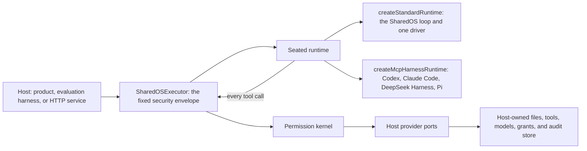

<p align="center">
  
</p>

<p align="center">
  <a href="https://www.npmjs.com/package/@aicoo/sharedos"></a>
  <a href="https://www.npmjs.com/package/@aicoo/sharedos"></a>
  <a href="LICENSE"></a>
</p>

<p align="center">
  Grant. Delegate. Execute.
</p>

SharedOS lets agents communicate, access files, and invoke built-in or external
tools without allowing a message, or a model, to grant itself authority. It is
the reusable authorization and execution layer beneath agent products and agent
evaluation systems alike.

> **Status:** a `1.0.0` preview. The API is not stable or production-hardened yet;
> pin an exact version if you need reproducibility.

## About SharedOS

**Grant.** Authority is an explicit capability grant, and no matching grant
means deny. What one agent asks of another ultimately targets state, and state
has two forms, each its own capability set:

| Access surface   | What it represents                                                                        | SharedOS control                                                  |
| ---------------- | ----------------------------------------------------------------------------------------- | ----------------------------------------------------------------- |
| Knowledge access | Accumulated understanding such as project context, identity, decisions, plans, and memory | `files` capabilities over explicit paths and actions              |
| Live tool access | Transient state and external side effects such as calendar, email, APIs, records, and MCP | Tool namespace enablement plus exact resource/action capabilities |

Accumulated understanding lives in files: memory is a role over authorized
files, never a second store with its own authority. Live state stays behind
tools, because a copied answer goes stale; it becomes durable knowledge only
when an agent writes it to a file, which is a separate permission decision. A
tool namespace is off until the host enables it, and enabling it is an
availability gate, never authority by itself. So a colleague's agent can search
one project subtree and read calendar free/busy without seeing personal notes or
sending email.

**Delegate.** A message coordinates work and carries one host-bound purpose; it
grants nothing. Running the receiving agent needs that recipient's own execution
grant, so asking three colleagues is three authorizations. A derived grant names
its parent, and SharedOS validates the whole chain before it authorizes
anything: no link is broader than the one above it, and a revoked or expired
ancestor ends everything beneath it. An agent that needs more than it holds does
not get a denial to work around. It asks through `sharedos.escalate`, the turn
ends as `escalated` naming the authority it needs, and deciding that is the
host's.

**Execute.** SharedOS runs one bounded agent turn. The runtime is replaceable;
the envelope around it is not. Authority is resolved once for the turn, the
agent is shown only the catalogue it may use, every call is authorized again at
the exact path and action, and the model never sees a grant or the authority
that issued it. Every refusal, from the envelope or the kernel, reaches audit
under one vocabulary of reason codes, and if audit cannot record a decision the
turn ends.

The longer argument, with a worked request, is in
[Why SharedOS exists](docs/README.md#why-sharedos-exists).

## Quick Start

```bash
npm install @aicoo/sharedos
```

Node.js 20.11 or newer; the packages are ESM-only. The
[quickstart](docs/quickstart.md) is two working programs, the kernel embedded in
your process and the same kernel over HTTP, written against the published
packages.

### Build from Source

Requirements: Node.js 20.11 or newer and pnpm 9.15.

```bash
git clone https://github.com/Aicoo-Team/SharedOS.git
cd SharedOS
pnpm install
pnpm build
pnpm example:quickstart
```

The example executes one Bob → Alice turn, consumes an explicit Alice execution
grant, filters the visible tool catalogue, then authorizes an exact file search.

SharedOS leaves storage, durable stores, and the model to the host, so a first
integration writes those before anything runs. The
[reference host](examples/reference-host/README.md) is a working one: a
filesystem `files` provider covering all twelve actions, SQLite stores for
bounded uses, revocation, namespace settings and audit, and a driver over a live
model. It needs Node.js 22.5 or newer for `node:sqlite`.

## How a turn runs



```text
Any host product or harness  ->  SharedOS contracts and runtime
SharedOS                    -X->  host product internals
```

Two runtimes ship:

- **`createStandardRuntime({ driver })`** is the SharedOS loop with one
  `AgentTurnDriver` seated. `StandardTurnDriver`, from
  `@aicoo/sharedos-adapters`, drives it from a model API; a host can seat its
  own driver.
- **`createMcpHarnessRuntime`**, from `@aicoo/sharedos-adapters/node`, puts a
  vendor CLI in the seat. Codex, Claude Code, DeepSeek Harness, or Pi reaches the
  same permission-filtered catalogue over MCP, and every call it makes comes back
  through the envelope.

A host can also install a `RuntimePlugin` of its own. Whichever runtime is
seated, the envelope does the same things: it admits the target agent, exposes
only the effective tool catalogue, withholds grants and issuing authority,
re-authorizes every exact tool call, wraps runtime events, applies the deadline,
and records the runtime id and version in the result. Runtime selection comes
from trusted host configuration, never from a message or a model-authored field.
An in-process plugin is trusted host code; an untrusted harness belongs in a
sandbox or a remote process behind the same boundary.

## Security invariants

1. No matching grant means deny.
2. A message carries data and one host-bound purpose, never authority.
3. Tool discovery is filtered, and every invocation is authorized again.
4. A tool namespace must be enabled independently of its capability grant.
5. Invoking a target agent requires its own recipient-scoped execution grant.
6. Reads, writes, messages, and external calls use the same capability model.
7. Resource, action, purpose, expiry, actor, authority, namespace, and trace are
   retained in authorization and audit decisions.
8. The model sees a sanitized context, never grants or issuing authority.
9. A host adapter cannot silently widen the authority evaluated by the core.

## Packages

| Package                       | Responsibility                                                                        |
| ----------------------------- | ------------------------------------------------------------------------------------- |
| `@aicoo/sharedos`             | One-install entry point re-exporting the production packages                          |
| `@aicoo/sharedos-contracts`   | JSON-safe protocol types, schemas, and stable identifiers                             |
| `@aicoo/sharedos-core`        | Deterministic authorization, routing, and dispatch decisions                          |
| `@aicoo/sharedos-os`          | Standard `files` operations and guarded OS tools                                      |
| `@aicoo/sharedos-precedent`   | R1-R4 admission for an auto-decision proposed from precedent                          |
| `@aicoo/sharedos-runtime`     | Fixed turn envelope, standard runtime, and plugin contract                            |
| `@aicoo/sharedos-adapters`    | The model driver, and the MCP harness runtime for Codex, Claude Code, DeepSeek and Pi |
| `@aicoo/sharedos-mcp`         | The permission-filtered catalogue served as an MCP tool server                        |
| `@aicoo/sharedos-http`        | Transport adapter over the same runtime and contracts                                 |
| `@aicoo/sharedos-client`      | Typed client for a remote SharedOS HTTP boundary                                      |
| `@aicoo/sharedos-testkit`     | In-memory providers and conformance helpers for tests                                 |
| `@aicoo/sharedos-conformance` | Standard execution records and adversarial conformance evidence                       |

Every package is released at one synchronized version, and the individual
packages are there for a host that wants a smaller dependency surface. `testkit`
is not a production persistence layer; production state remains in the host.

## Integration modes

Choose by where SharedOS runs relative to your code. The contracts and the
permission model are the same either way.

| If you…                                                                   | Use                                                                                                            | Start at                                                                                         |
| ------------------------------------------------------------------------- | -------------------------------------------------------------------------------------------------------------- | ------------------------------------------------------------------------------------------------ |
| run Node.js and already own transactions, persistence, and model calls    | **Embedded library**, the default: `@aicoo/sharedos` in your process, your services behind the provider ports  | [Embedded integration, step by step](docs/host-integration.md#embedded-integration-step-by-step) |
| need process or language isolation more than you mind one more deployment | **HTTP boundary**: the handler from `@aicoo/sharedos` on the server, `@aicoo/sharedos-client` in the caller    | [Remote integration](docs/host-integration.md#remote-integration)                                |
| run an evaluation harness                                                 | Either of the above, **one turn per tick**; add `@aicoo/sharedos-conformance` for comparable execution records | [Conformance package](packages/conformance/README.md)                                            |

Over HTTP, transport authentication establishes the caller; it does not replace
capability authorization. A harness keeps tick order, budgets, snapshots, judges,
and metrics; SharedOS still executes one bounded turn. The mode is separate from
the runtime: any of them can seat either runtime in
[How a turn runs](#how-a-turn-runs).

## Examples

| Run                                                                                    | Shows                                                                                  |
| -------------------------------------------------------------------------------------- | -------------------------------------------------------------------------------------- |
| [`pnpm example:quickstart`](examples/quickstart/src/index.ts)                          | One Bob → Alice turn: execution grant, filtered catalogue, an authorized file search   |
| [`pnpm example:reference-host`](examples/reference-host/README.md)                     | A working host: filesystem `files` provider, SQLite stores, a driver over a live model |
| [`pnpm example:fleet-delegation`](examples/fleet-delegation/src/index.ts)              | Delegation: a robot passes on no more than it holds, and loses it on upstream revoke   |
| [`pnpm example:recipient-fanout`](examples/recipient-fanout/README.md)                 | Three recipients are three authorizations, and three different refusals                |
| [`pnpm example:permission-shaped-search`](examples/permission-shaped-search/README.md) | One query, three agents, three answers; a denied call never reaches the provider       |
| [`pnpm example:network-studio`](examples/network-studio/DESIGN.md)                     | A front-end prototype of two agent-network modes; a simulation that invokes no agents  |

## Documentation

- **Start:** [quickstart](docs/quickstart.md) ·
  [host integration guide](docs/host-integration.md) ·
  [every endpoint](docs/endpoints.md)
- **Reference:** [HTTP API](docs/http-api.md) · [MCP API](docs/mcp-api.md) ·
  [MCP toolshare](docs/mcp-toolshare.md) · [tool catalogue](docs/tools.md) ·
  [reason and error codes](docs/errors.md) · [package API](docs/api/README.md)
- **Design:** [architecture](docs/architecture.md) ·
  [permission model](docs/security/permission-model.md) ·
  [threat model](docs/security/threat-model.md) ·
  [architecture decisions](docs/README.md#architecture-decisions)
- **Evidence:**
  [kernel conformance manifest](docs/conformance/kernel-conformance.md), every
  row an attempted violation and what refused it ·
  [systems cost](docs/conformance/systems-cost.md), what enforcement costs apart
  from the model

The full index is [docs/README.md](docs/README.md).

## What SharedOS owns

SharedOS owns the **semantics and enforcement** of capabilities. The host owns
the files, notes, folders, indexes, embeddings, credentials, and lifecycle, and
it keeps its product UI, accounts, and billing. Benchmark tasks, gold labels,
evaluators, and multi-tick experiment scheduling belong to the evaluation system
above it. The SharedOS core must not import a host's web framework, ORM, cloud
SDK, or runners.

SharedOS stops at authorization, messaging, brokered tools, and one bounded
runtime turn. Task-level self-organization, recursive delegation, recovery
policy, and cross-task experience belong to the separate
[Runtime Agent Coordination](https://github.com/Aicoo-Team/runtime-agent-coordination)
host project.

## Development

```bash
pnpm install
pnpm check         # format, typecheck, tests, release tests, API docs, conformance
pnpm pack:lint     # build, then publint on every package
pnpm pack:check    # pack every package and install the tarballs into a fresh consumer
pnpm pack:preview  # the same, keeping the tarballs in artifacts/npm/
```

`pnpm check` does not run the three package gates; run them before a change that
touches a package manifest, an export, or a package README. The repository is a
TypeScript workspace. Public contracts must stay JSON-safe, and permission
changes require tests for both allowed and denied paths. See
[CONTRIBUTING.md](CONTRIBUTING.md) before proposing a change.

Released changes are in the [changelog](CHANGELOG.md), the remaining
production-hardening work in [release readiness](docs/release-readiness.md), and
the publishing procedure in the [npm release runbook](docs/npm-release.md).

## License

SharedOS is licensed under the [Apache License 2.0](LICENSE).
