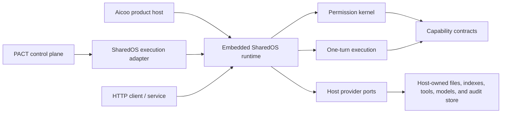

# SharedOS

SharedOS is a **permission-controlled agent-to-agent runtime**. It lets agents
communicate, access files, and invoke built-in or external tools without
allowing a message—or a model—to grant itself authority.

SharedOS is more than a messaging protocol. It provides the reusable execution
and authorization layer beneath products such as Aicoo and experiment systems
such as PACT.

> **Project status:** initial architecture and contracts are under active
> development. Every workspace package is intentionally private: the `0.x`
> API is not published or production-ready yet.

## What belongs in SharedOS

- A deny-by-default permission kernel based on explicit capability grants.
- Structured agent identities, addresses, messages, namespaces, and traces.
- Agent-to-agent request and response dispatch.
- A canonical `files` resource contract, including deterministic operations
  such as list, read, search, grep, create, replace, append, delete, and snapshot.
- A registry for built-in OS capabilities and host-provided external or MCP
  tools.
- One permission-controlled agent turn, with provenance and audit events.
- Equivalent embedded-library and HTTP client boundaries over the same
  contracts.

SharedOS owns the **semantics and enforcement** of file capabilities. The host
owns the files, notes, folders, indexes, embeddings, credentials, and lifecycle.
Memory is a role or mounted view of authorized files, never a second authority
or storage namespace.

SharedOS deliberately does not own product UI, accounts, billing, benchmark
tasks, gold labels, evaluators, or multi-tick experiment scheduling.

## Architecture at a glance



The dependency direction is always:

```text
Aicoo / PACT / another host  ->  SharedOS contracts and runtime
SharedOS                    -X->  host product internals
```

The SharedOS core must not import Next.js, Drizzle, Azure, Aicoo credits, or
PACT tasks, gold data, runners, and evaluators.

Read the complete [architecture](docs/architecture.md),
[permission model](docs/security/permission-model.md), and
[threat model](docs/security/threat-model.md).

## Packages

| Package               | Responsibility                                               |
| --------------------- | ------------------------------------------------------------ |
| `@sharedos/contracts` | JSON-safe protocol types, schemas, and stable identifiers    |
| `@sharedos/core`      | Deterministic authorization, routing, and dispatch decisions |
| `@sharedos/os`        | Standard `files` operations and guarded OS tools             |
| `@sharedos/runtime`   | One permission-controlled agent turn over host providers     |
| `@sharedos/client`    | Typed client for a remote SharedOS HTTP boundary             |
| `@sharedos/http`      | Transport adapter over the same runtime and contracts        |
| `@sharedos/sdk`       | One-install entry point re-exporting the production packages |
| `@sharedos/testkit`   | In-memory providers and conformance helpers for tests        |

`testkit` is not a production persistence layer. Production state remains in
the host.

## Integration modes

**Embedded library — recommended for Aicoo.** Aicoo keeps authentication,
billing, UI, and its existing persistence. It implements SharedOS provider
ports, then calls the runtime in-process. See the
[Aicoo integration guide](docs/integrations/aicoo.md) and the concrete
[Pulse migration plan](docs/integrations/pulse-migration.md).

**Execution adapter — recommended for PACT.** PACT creates an isolated world and
asks SharedOS to execute one turn at a time. PACT remains responsible for tick
order, budgets, stopping, snapshots, judges, metrics, and artifacts. See the
[PACT integration guide](docs/integrations/pact.md).

**HTTP boundary.** Deployments that cannot embed the runtime can expose the same
contracts through `@sharedos/http` and consume them with `@sharedos/client`.
Transport authentication establishes the caller; it does not replace capability
authorization.

## Security invariants

1. No matching grant means deny.
2. A message carries intent and context, never authority.
3. Tool discovery is filtered, and every invocation is authorized again.
4. Invoking a target agent requires its own recipient-scoped execution grant.
5. Reads, writes, messages, and external calls use the same capability model.
6. Resource, action, purpose, expiry, actor, authority, namespace, and trace are
   retained in authorization and audit decisions.
7. The model sees a sanitized context, never grants or issuing authority.
8. A host adapter cannot silently widen the authority evaluated by the core.

## Local quickstart

The packages are not available from npm yet. Run the workspace example from a
local clone:

```bash
pnpm install
pnpm example:quickstart
```

The example executes one Bob → Alice turn, consumes an explicit Alice execution
grant, filters the visible tool catalog, then authorizes an exact file search.
See [`examples/quickstart`](examples/quickstart/src/index.ts).

To explore the two proposed agent-network product modes as an interactive UI,
run the local Network Studio prototype:

```bash
pnpm example:network-studio
```

The prototype compares fixed-entry runtime coordination with an adaptive,
trainable network and visualizes entry agents, completion policy, topology, and
run state. It is a front-end simulation and does not invoke real agents.

## Package preview

The intended one-install entry point is `@sharedos/sdk`. Individual packages
remain available for hosts that want a smaller dependency surface. Until a
license and npm scope ownership are confirmed, packages remain private and are
generated only as local prerelease tarballs.

```bash
pnpm pack:preview
```

This builds every package, verifies that `workspace:*` dependencies were
rewritten to exact prerelease versions, installs the tarballs into a fresh
consumer project, and checks both runtime imports and TypeScript declarations.
Artifacts are written to `artifacts/npm/`.

## Development

Requirements: Node.js 20.11 or newer and pnpm 9.15.

```bash
pnpm install
pnpm check
```

The repository is a TypeScript workspace. Public contracts must stay JSON-safe,
and permission changes require tests for both allowed and denied paths. See
[CONTRIBUTING.md](CONTRIBUTING.md) before proposing a change.

Public release is deliberately gated on the items in
[release readiness](docs/release-readiness.md), including a license decision,
npm scope ownership, durable replay/idempotency, and security contact setup.

## Architecture decisions

- [ADR 0001: Library-first runtime](docs/adr/0001-library-first-runtime.md)
- [ADR 0002: Host-owned storage](docs/adr/0002-host-owned-storage.md)
- [ADR 0003: Scheduler boundary](docs/adr/0003-scheduler-boundary.md)
- [ADR 0004: Canonical resource path segments](docs/adr/0004-canonical-resource-path-segments.md)
- [ADR 0005: Files are the canonical resource plane](docs/adr/0005-files-resource-plane.md)

## License

No license has been declared yet. Until one is added, no permission is granted
to copy, modify, or redistribute this code outside the repository owner's
authorization.
