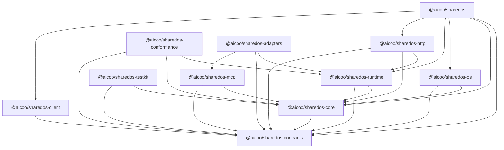
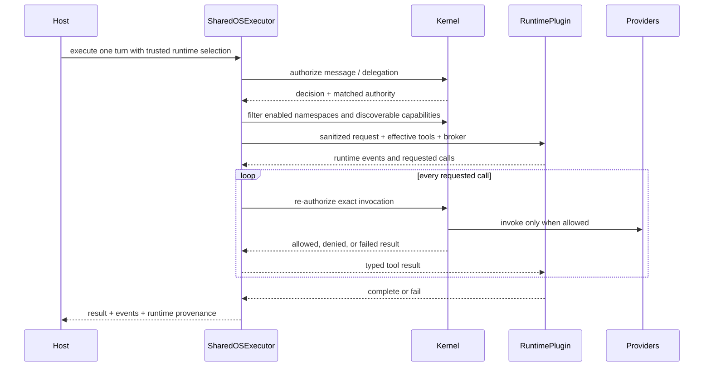

# SharedOS architecture

## Definition

SharedOS is a host-neutral, permission-controlled kernel with a pluggable
execution layer for agent-to-agent delegation. A delegation can include
communication, access to files, and invocation of built-in or external tools.

The central rule is:

> A message conveys intent and context. Only an independently evaluated
> capability grant conveys authority.

This separates a model's requested action from the policy decision that permits
or rejects it.

## Responsibility map

| Concern     | SharedOS owns                                                      | Host owns                                                      |
| ----------- | ------------------------------------------------------------------ | -------------------------------------------------------------- |
| Identity    | Structured human, agent, group, and service addresses              | Account login, sessions, identity proofing                     |
| Permissions | Grant semantics, evaluation, revocation behavior, decision records | Grant persistence, consent UI, organizational policy ceiling   |
| Messaging   | Envelopes, routing, dispatch, provenance                           | Product inbox, notifications, retention UX                     |
| Files       | Paths, operations, authorization, result and audit contracts       | Notes, folders, storage, indexes, embeddings and deletion      |
| Memory      | Rule that mounted/indexed context retains source file authority    | Selection, compaction, ranking and context assembly            |
| Tools       | Namespace/catalog contracts, filtered discovery, invocation gate   | Settings storage, OAuth, MCP connections, tool implementations |
| Execution   | Security envelope, runtime contract, standard loop and provenance  | Runtime selection, model configuration and product policy      |
| Audit       | Audit event shape and required provenance                          | Durable append-only storage, export and retention              |
| Scheduling  | No product or benchmark scheduler                                  | Heartbeats, experiment ticks, retries, budgets and stopping    |

The host may delegate some operations to infrastructure providers, but remains
responsible for satisfying the provider contracts and security requirements.

## Package boundaries



### `@aicoo/sharedos-contracts`

Contains JSON-safe, transport-neutral schemas. Important concepts include:

- Structured `Address` values for humans, agents, groups, and services.
- `MessageEnvelope`, including sender, receiver, intent, purpose, and trace.
- `CapabilityGrant`, `CapabilityRequirement`, and `AuthorizationDecision`.
- Resource and tool descriptors, tool namespace control-plane requests,
  execution inputs, results, and HTTP schemas.

Contracts cannot contain database handles, framework request objects, model SDK
instances, or product-specific types.

### `@aicoo/sharedos-core`

Contains host-neutral policy and dispatch behavior. It evaluates complete grants
against complete requests, applies tool namespace selection, filters capability
discovery, and produces explicit allow or deny decisions. All network and
persistence effects remain behind host provider ports.

### `@aicoo/sharedos-runtime`

Provides the fixed `SharedOSExecutor` security envelope, the replaceable
`RuntimePlugin` contract, and `StandardRuntime`, the reference bounded driver
loop. The envelope owns security-check ordering; plugins own harness behavior;
neither owns the host's data implementation.

### `@aicoo/sharedos-os`

Defines the portable `files` vocabulary—including list, stat, read, search,
grep, create, replace, append, delete, and snapshot operations—and adapts those
resources into permission-controlled agent tools. Hosts provide the storage
implementation; the package provides schemas, exact per-call capability
resolution, and stable tool definitions.

### Adapters

`@aicoo/sharedos-http` exposes the runtime at a process boundary.
`@aicoo/sharedos-client` consumes that boundary. Both must preserve the contracts and
must not develop a second authorization model.

`@aicoo/sharedos-testkit` supplies deterministic in-memory providers and conformance
fixtures. It is intended for unit tests and examples, not production storage.

`@aicoo/sharedos-conformance` turns a turn's evidence into one comparable
execution record, and runs the adversarial conformance suite that reports what
the kernel refused and where. It holds no tasks, gold labels, or scores:
SharedOS states what happened and never whether it was correct.

`@aicoo/sharedos-adapters` installs Codex, Claude Code, DeepSeek Harness, and Pi
as agent turn drivers. An adapter is translation only. The turn loop,
permission-filtered catalogue, per-call re-authorization, and audit all come from
the execution envelope, so a new harness changes no kernel code and adds no
second permission path.

`@aicoo/sharedos-mcp` serves that same permission-filtered catalogue to a harness
that runs its own loop, over the Model Context Protocol. It is the other half of
the harness story: a driver puts SharedOS in the model provider's seat, while the
MCP bridge lets the vendor CLI keep its own loop, on whatever model it is
configured with, and connect to SharedOS as a tool server. Both paths converge on `RuntimeHost.invokeTool`, which stays the
only execution path. See [MCP toolshare](mcp-toolshare.md).

`@aicoo/sharedos` is an ergonomic distribution layer that re-exports the
production packages from one install. It contains no policy, storage, or
transport logic and does not change the dependency direction.

## Domain model

### Execution namespace and world

A namespace is the mandatory tenant and isolation boundary for identifiers,
grants, messages, resources, and audit events. A world is the host-provided state
visible to an execution within a namespace. PACT normally creates a fresh world
per run; Aicoo maps a namespace to durable product state.

No unqualified identifier is globally resolvable. Provider calls receive the
namespace explicitly.

This execution namespace is distinct from two other identifiers:

- `ResourceRef.namespace` selects an authority domain such as `files`,
  `calendar`, or `sharedos.messaging`.
- `ToolDefinition.namespace` groups a logical family of tools such as
  `calendar`, `email`, or a user-connected `notion` MCP server.

The three identifiers can contain the same string, but one never implies
another. A world boundary prevents tenant crossover; a resource namespace
scopes a capability; a tool namespace controls whether a family is present in
the current tool surface.

### Structured addresses

Addresses use a tagged representation instead of string suffixes or prefixes:

```ts
type Address =
  | { kind: "human"; userId: string }
  | { kind: "agent"; agentId: string }
  | { kind: "group"; conversationId: string }
  | { kind: "service"; serviceId: string };
```

This prevents parsing conventions from becoming an undocumented security
boundary and enables exhaustive routing checks.

### Capability grant

A capability grant records who issued authority, who receives it, which complete
resource selectors and actions it covers, the allowed purpose, expiry and
delegation constraints. Authorization evaluates the requested tuple as a whole;
it must not merge independent fields from several grants into a new authority
that no issuer created.

See the [permission model](security/permission-model.md) for normative
invariants.

### Resource providers

SharedOS defines operations, authorization hooks, cancellation, and result
shapes. Hosts implement the exported `ResourceProvider` port, for example:

```ts
const files: ResourceProvider = {
  namespace: "files",
  async invoke(operation, signal) {
    signal.throwIfAborted();
    return invokeHostFileOperation(operation);
  },
};
```

An Aicoo provider can map notes and folders to files while using its search
index for `files.search`. A PACT provider can use an isolated in-memory world.
The runtime sees only the provider contract.

Memory, active work, raw evidence, and curated knowledge may be represented as
different file roots. Indexes and context mounts are derived views: they must
preserve the grants of their source files and cannot introduce a second
resource identity.

### Built-in and external capabilities

Built-in OS capabilities use stable resource/action pairs and registered tool
names such as:

- `sharedos.execution` + `invoke`, scoped to a target agent
- `sharedos.messaging` + `send`, scoped to a recipient
- `files.list`, `files.stat`, `files.read`, `files.search`, `files.grep`
- `files.create`, `files.replace`, `files.append`, `files.delete`
- `files.snapshot.create`, `files.snapshot.list`, `files.snapshot.restore`

External capabilities—calendar, email, GitHub, Notion, MCP servers, and similar
connectors—are registered by a host. Both categories appear in one filtered
registry and pass through one execution-time authorization gate. A tool is not
trusted merely because it was registered.

Every tool also declares a logical namespace, source, and conservative
read/write classification. A trusted access context contains the effective
enabled namespace selection. Registration, namespace enablement, and capability
authority are independent requirements:

```text
usable tool = registered for this context
              AND namespace enabled
              AND capability allowed
```

Static tools use `ToolRegistry`. User-specific MCP or connector catalogs use a
`ContextToolProvider`; the kernel builds an ephemeral registry per operation so
one user's reload cannot mutate another user's catalog. `listToolNamespaces`
aggregates the available context-specific namespaces and their enabled state.
`updateToolNamespaces` applies an idempotent patch through a host-owned,
atomic `ToolNamespaceSettingsStore` and returns the effective catalog.

The host persists the setting and reconstructs it into future access contexts.
It also owns adding or removing MCP connections and protecting credentials.
SharedOS never connects a Notion server by itself; once a host supplies that
user's Notion handlers, SharedOS applies the same namespace and capability gates
as it does to native and `files` tools.

## One-turn execution



The security envelope preserves deny decisions as observable, machine-readable
events. A runtime cannot turn a denied write into a best-effort write, silently
retry with a wider identity, enumerate a hidden registry, or retain the broker
after the turn closes.

`StandardRuntime` uses `AgentTurnDriver` as its model/provider seam. A complete
alternative harness implements `RuntimePlugin` instead. Both receive frozen,
sanitized input without grants or issuing authority. Turn timeouts are bounded
and their `AbortSignal` is propagated through plugins, drivers, tools,
resources, and HTTP requests. Every plugin receives the effective step budget,
and the envelope holds both ceilings itself rather than trusting the plugin to:
a hard tool-call limit, which needs nothing from the runtime, and a step limit
over the steps a plugin declares. A plugin that declares no step is bounded by
the call ceiling alone, because the envelope sees tool calls and cannot infer
model turns from them.

`RuntimeRegistry` is instance-scoped and populated by trusted host
configuration. The model-visible request does not contain a runtime selector.
Every result includes an authoritative runtime id, implementation version, and
SharedOS protocol version. Model, runtime, and execution backend are separate
dimensions: for example, a Codex runtime may execute locally or in a Vercel
sandbox, and a DeepSeek model may run inside the standard loop or DeepSeek's own
harness.

JavaScript cancellation is cooperative. In-process runtime plugins and
production providers are trusted components and must stop before committing a
side effect when their signal aborts. Untrusted harnesses require process,
container, microVM, or remote isolation around the same capability-broker
boundary.

## Scheduler boundary

SharedOS executes one turn; a host decides when and how often turns happen.

- Aicoo owns production heartbeat scheduling, delivery policy, billing and
  retries.
- PACT owns experimental ticks, order, budgets, stopping conditions, snapshots,
  judge execution, gold labels, statistics and artifacts.
- SharedOS owns permission-controlled execution inside each individual turn.

The legacy `experiment_v2.ts` orchestration therefore belongs to PACT. Generic
logic extracted from it may enter SharedOS only if it describes a single turn
without benchmark or product scheduling semantics.

## Deployment shapes

### Embedded

The host imports contracts and runtime packages and provides adapters in the
same process. This is the default for Aicoo because it avoids a second network
hop and lets the existing product own transactions.

### Remote

A service wraps the same runtime through `@aicoo/sharedos-http`; callers use
`@aicoo/sharedos-client`. Authentication verifies the transport caller, while the
kernel separately evaluates capability authority. Remote deployment does not
change permission semantics.

The HTTP surface uses RPC semantics: a valid domain denial or provider failure
is returned as a typed result with HTTP 200. Message submission returns 202 only
when the transport reports `accepted`; completed, denied, or failed delivery
results use 200. Malformed, unauthenticated, and transport-level failures use
4xx/5xx responses.

## Dependency rule

SharedOS code cannot import:

- Aicoo routes, database schema, credit accounting, UI, or framework request
  types;
- PACT tasks, gold labels, runner orchestration, judges, or metrics;
- a required vendor-specific model, database, vector store, or tool SDK.

Hosts depend on SharedOS and satisfy its ports. SharedOS never reaches upward
into a host product.
