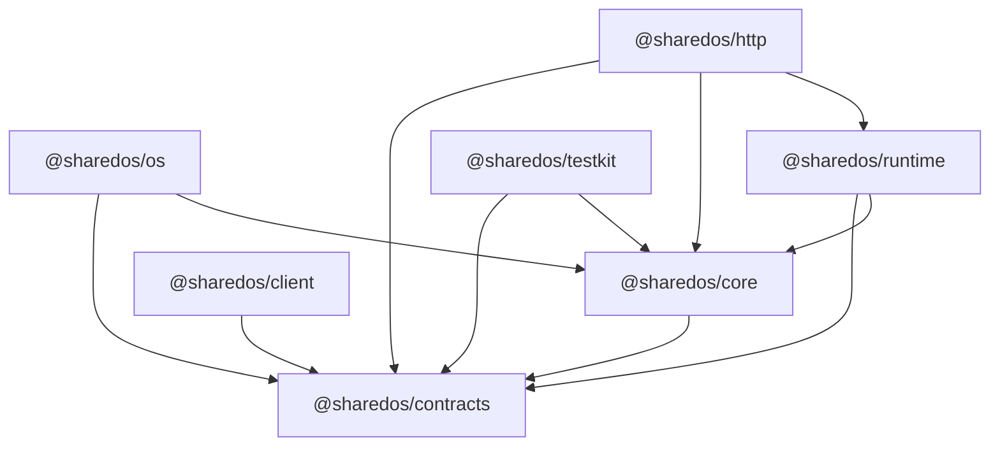
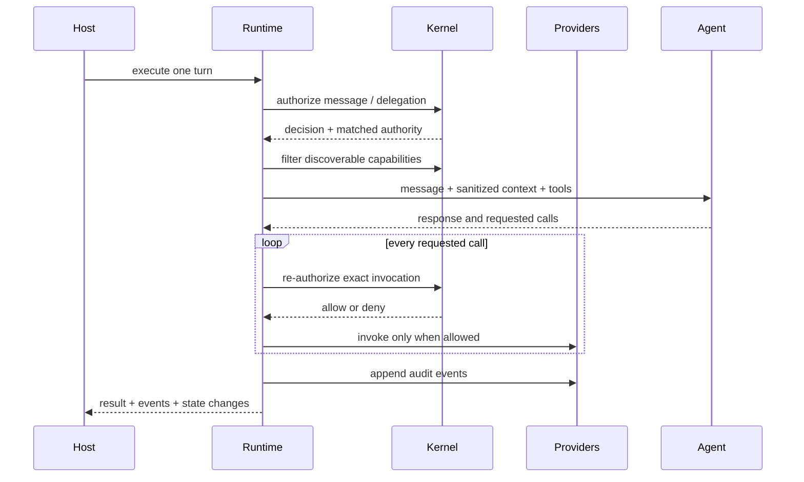

# SharedOS architecture

## Definition

SharedOS is a host-neutral, permission-controlled runtime for agent-to-agent
delegation. A delegation can include communication, access to memory or
workspace resources, and invocation of built-in or external tools.

The central rule is:

> A message conveys intent and context. Only an independently evaluated
> capability grant conveys authority.

This separates a model's requested action from the policy decision that permits
or rejects it.

## Responsibility map

| Concern     | SharedOS owns                                                      | Host owns                                                      |
| ----------- | ------------------------------------------------------------------ | -------------------------------------------------------------- |
| Identity    | Structured human, agent, group, and service addresses              | Account login, sessions, identity proofing                     |
| Permissions | Grant semantics, evaluation, revocation behavior, decision records | Grant persistence, consent UI, organizational policy ceiling   |
| Messaging   | Envelopes, routing, dispatch, provenance                           | Product inbox, notifications, retention UX                     |
| Memory      | Capability names, query contracts, authorization, context mounting | Records, database, embeddings, tenancy, deletion               |
| Workspace   | Read/search/grep/write semantics and authorization                 | Files, notes, folders, sandbox or database implementation      |
| Tools       | Registry contracts, permission-filtered discovery, invocation gate | OAuth, secrets, MCP connections, concrete tool implementations |
| Execution   | One bounded agent turn and its event stream                        | Model provider configuration and product policy                |
| Audit       | Audit event shape and required provenance                          | Durable append-only storage, export and retention              |
| Scheduling  | No product or benchmark scheduler                                  | Heartbeats, experiment ticks, retries, budgets and stopping    |

The host may delegate some operations to infrastructure providers, but remains
responsible for satisfying the provider contracts and security requirements.

## Package boundaries



### `@sharedos/contracts`

Contains JSON-safe, transport-neutral schemas. Important concepts include:

- Structured `Address` values for humans, agents, groups, and services.
- `MessageEnvelope`, including sender, receiver, intent, purpose, and trace.
- `CapabilityGrant`, `CapabilityRequirement`, and `AuthorizationDecision`.
- Resource and tool descriptors, execution inputs, results, and HTTP schemas.

Contracts cannot contain database handles, framework request objects, model SDK
instances, or product-specific types.

### `@sharedos/core`

Contains host-neutral policy and dispatch behavior. It evaluates complete grants
against complete requests, filters capability discovery, and produces explicit
allow or deny decisions. All network and persistence effects remain behind host
provider ports.

### `@sharedos/runtime`

Coordinates one bounded agent turn. It uses provider ports for state, memory,
workspace, tools, the responding agent, and audit persistence. Runtime owns the
order of security checks but not the host's data implementation.

### `@sharedos/os`

Defines the portable memory and workspace vocabulary—including read, search,
grep, append, write, and snapshot operations—and adapts those resources into
permission-controlled agent tools. Hosts provide the storage implementation;
the package provides schemas, exact per-call capability resolution, and stable
tool definitions.

### Adapters

`@sharedos/http` exposes the runtime at a process boundary.
`@sharedos/client` consumes that boundary. Both must preserve the contracts and
must not develop a second authorization model.

`@sharedos/testkit` supplies deterministic in-memory providers and conformance
fixtures. It is intended for unit tests and examples, not production storage.

## Domain model

### Namespace and world

A namespace is the mandatory tenant and isolation boundary for identifiers,
grants, messages, resources, and audit events. A world is the host-provided state
visible to an execution within a namespace. PACT normally creates a fresh world
per run; Aicoo maps a namespace to durable product state.

No unqualified identifier is globally resolvable. Provider calls receive the
namespace explicitly.

### Structured addresses

Addresses use a tagged representation instead of string suffixes or prefixes:

```ts
type Address =
  | { kind: "human"; userId: string }
  | { kind: "agent"; agentId: string }
  | { kind: "group"; conversationId: string }
  | { kind: "service"; serviceId: string };
```

This prevents parsing conventions from becoming an undocumented security
boundary and enables exhaustive routing checks.

### Capability grant

A capability grant records who issued authority, who receives it, which complete
resource selectors and actions it covers, the allowed purpose, expiry and
delegation constraints. Authorization evaluates the requested tuple as a whole;
it must not merge independent fields from several grants into a new authority
that no issuer created.

See the [permission model](security/permission-model.md) for normative
invariants.

### Resource providers

SharedOS defines operations, authorization hooks, cancellation, and result
shapes. Hosts implement the exported `ResourceProvider` port, for example:

```ts
const memory: ResourceProvider = {
  namespace: "memory",
  async invoke(operation, signal) {
    signal.throwIfAborted();
    return searchHostMemory(operation);
  },
};
```

An Aicoo provider can use Postgres and an embedding service. A PACT provider can
use an isolated in-memory world. The runtime sees only the provider contract.

### Built-in and external capabilities

Built-in OS capabilities use stable resource/action pairs and registered tool
names such as:

- `sharedos.execution` + `invoke`, scoped to a target agent
- `sharedos.messaging` + `send`, scoped to a recipient
- `memory.search`, `memory.read`, `memory.append`
- `workspace.list`, `workspace.read`, `workspace.search`, `workspace.grep`
- `workspace.write`
- `workspace.snapshot.create`, `workspace.snapshot.restore`

External capabilities—calendar, email, GitHub, Notion, MCP servers, and similar
connectors—are registered by a host. Both categories appear in one filtered
registry and pass through one execution-time authorization gate. A tool is not
trusted merely because it was registered.

## One-turn execution



The runtime must preserve deny decisions as observable, machine-readable events.
It must not turn a denied write into a best-effort write or silently retry with a
wider identity.

The agent driver never receives grants or issuing authority. Turn timeouts are
bounded and their `AbortSignal` is propagated through drivers, tools, resources,
and HTTP requests. JavaScript cancellation is cooperative, so production
providers are trusted components and must stop before committing a side effect
when their signal aborts.

## Scheduler boundary

SharedOS executes one turn; a host decides when and how often turns happen.

- Aicoo owns production heartbeat scheduling, delivery policy, billing and
  retries.
- PACT owns experimental ticks, order, budgets, stopping conditions, snapshots,
  judge execution, gold labels, statistics and artifacts.
- SharedOS owns permission-controlled execution inside each individual turn.

The legacy `experiment_v2.ts` orchestration therefore belongs to PACT. Generic
logic extracted from it may enter SharedOS only if it describes a single turn
without benchmark or product scheduling semantics.

## Deployment shapes

### Embedded

The host imports contracts and runtime packages and provides adapters in the
same process. This is the default for Aicoo because it avoids a second network
hop and lets the existing product own transactions.

### Remote

A service wraps the same runtime through `@sharedos/http`; callers use
`@sharedos/client`. Authentication verifies the transport caller, while the
kernel separately evaluates capability authority. Remote deployment does not
change permission semantics.

The HTTP surface uses RPC semantics: a valid domain denial or provider failure
is returned as a typed result with HTTP 200. Message submission returns 202 only
when the transport reports `accepted`; completed, denied, or failed delivery
results use 200. Malformed, unauthenticated, and transport-level failures use
4xx/5xx responses.

## Dependency rule

SharedOS code cannot import:

- Aicoo routes, database schema, credit accounting, UI, or framework request
  types;
- PACT tasks, gold labels, runner orchestration, judges, or metrics;
- a required vendor-specific model, database, vector store, or tool SDK.

Hosts depend on SharedOS and satisfy its ports. SharedOS never reaches upward
into a host product.
