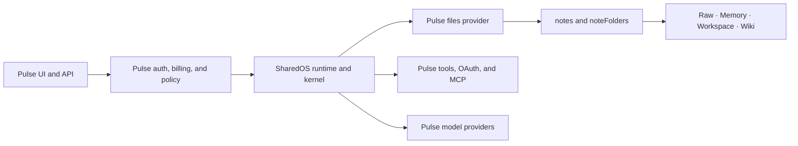

# Integrating Aicoo/Pulse with SharedOS

## Target relationship

Pulse is the product host. SharedOS supplies host-neutral file authorization,
tool dispatch, messaging contracts, and one bounded agent turn. Pulse keeps its
database, routes, scheduling, product policy, and model integrations.

The dependency remains one-way: Pulse imports SharedOS; SharedOS never imports
Pulse product code.

## File-as-memory mapping

Pulse's four root spaces are all backed by the same notes and folders model.
`Memory` is therefore not a second resource provider. It is a protected root,
semantic role, and retrieval view over files.

| Pulse concept                 | SharedOS representation                              |
| ----------------------------- | ---------------------------------------------------- |
| Raw, Memory, Workspace, Wiki  | First segment of a canonical `files` path            |
| Note/folder hierarchy         | Host implementation of `ResourceProvider`            |
| Memory embeddings and loaders | Derived index/view that preserves source-file grants |
| Notes management tools        | Standard `files.*` tools                             |
| Tool namespace preferences    | Host store behind SharedOS namespace control port    |
| Per-user MCP tool catalog     | SharedOS context-specific tool provider              |
| Agent permission rows         | Host ceiling plus trusted capability grants          |
| Agent v04 response path       | Host driver around one SharedOS turn                 |
| Heartbeats and recurring work | Pulse-owned scheduling outside one-turn runtime      |

A source note such as `/Memory/Self/MEMORY.md` is authorized as the structured
path `["Memory", "Self", "MEMORY.md"]`. Its database ID and revision remain
host metadata; they do not replace the capability path.

## Ownership boundary

Pulse keeps authentication, sessions, billing, quotas, Next.js routes, Drizzle
schemas, Postgres transactions, embeddings, OAuth credentials, MCP connections,
tool namespace setting rows, conversation persistence, heartbeats, retries, and
user-facing consent.

SharedOS owns the portable operation names, complete capability matching,
tool namespace catalog/update semantics, permission-filtered discovery,
invocation re-authorization, message and execution contracts, one-turn
ordering, and audit event shape.

Search indexes, snippets, counts, and embeddings must be filtered by authorized
file scope inside the query. Filtering only the final matches is insufficient.

## Adoption

Pulse should adopt SharedOS as a strangler migration, not by replacing its
database or copying `/api/v1/os` into this repository:

1. Implement a Pulse `files` provider over the current notes/folders queries.
2. Translate existing agent permissions into a host ceiling and trusted grants.
3. Run SharedOS authorization in shadow mode and compare decisions.
4. Route file reads/search through SharedOS, then file mutations.
5. Move native and per-user MCP tools behind the SharedOS namespace control
   plane and capability gate.
6. Put the agent-v04 and shared-agent execution paths behind one SharedOS turn.
7. Converge network messaging and tool dispatch after file parity is proven.

The detailed cutover, code seams, rollout gates, and acceptance criteria are in
[Pulse migration plan](./pulse-migration.md).
