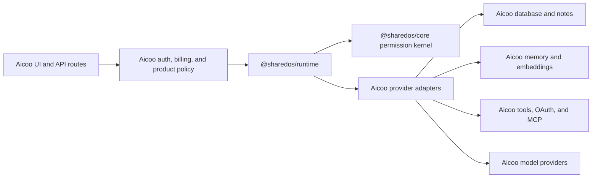

# Integrating Aicoo with SharedOS

## Target relationship

Aicoo is a product host. It should embed SharedOS first, keep its existing
product responsibilities, and implement the storage and service providers that
the SharedOS runtime consumes.



SharedOS does not import Aicoo. Aicoo imports SharedOS and maps its product state
onto SharedOS contracts.

## What stays in Aicoo

- Next.js routes and request lifecycle.
- User authentication, sessions, API keys, and account ownership.
- Billing, credits, quotas, and product rate limits.
- Inbox, conversation UI, notifications, groups, and human consent screens.
- Drizzle schemas, Postgres transactions, Azure or other embedding services.
- OAuth credentials, concrete MCP connections, and product-specific tools.
- Production heartbeat scheduling, delivery policy, and retry timing.

Transport authentication determines which principal is calling. The SharedOS
kernel still determines whether that principal has authority for the requested
resource and action.

## What moves behind SharedOS contracts

The behavior currently represented by Aicoo's network and shared-agent paths
should converge on SharedOS use cases:

| Existing concern            | SharedOS boundary                           | Aicoo adapter responsibility                             |
| --------------------------- | ------------------------------------------- | -------------------------------------------------------- |
| Agent connection and grants | Grant lifecycle and authorization semantics | Persist requests, grants, revocations, and consent state |
| Agent messaging             | Structured message envelope and dispatch    | Resolve Aicoo identities and persist conversations       |
| Permission-scoped tools     | Registry filtering and invocation re-check  | Register concrete Aicoo and MCP tools                    |
| Notes and workspace grep    | Workspace resource operations               | Query Aicoo notes, folders, and files                    |
| Memory search               | Memory capability and result contract       | Store/search records and embeddings                      |
| Agent response loop         | One-turn runtime                            | Supply model responder and host transaction policy       |
| Replay and audit            | Stable operation IDs and audit event shape  | Durable deduplication, outbox, and retention             |

`/v1/os/*` should not be copied wholesale into SharedOS. Those routes directly
expose Aicoo's data model. Instead, extract their portable resource semantics
(`memory.search`, `workspace.grep`, and similar operations) into SharedOS, then
implement them against Aicoo state.

## Provider set

An Aicoo integration will normally provide:

- identity and address resolution;
- grant and revocation persistence;
- message and conversation persistence;
- memory and workspace operations;
- built-in and external tool registration/invocation;
- model or agent response execution;
- durable idempotency and audit append;
- an optional transaction/unit-of-work boundary.

Providers must never interpret the model's message as a grant. They receive an
authorized context produced by SharedOS and must reject namespace or resource
mismatches rather than silently widening them.

Before opening an agent responder, Aicoo must issue or load a target-scoped
capability built with `agentExecutionCapability`. Message delivery uses the
separate `messageSendCapability`; neither grant implies the other.

## Recommended adoption sequence

No Aicoo changes are required during the initial SharedOS repository bootstrap.
When integration begins, use these stages:

Aicoo must confirm and declare the SharedOS Node.js floor (`>=20.11`) before
integration. PACT currently declares Node 18 and must upgrade separately.

### 1. Contract mapping

Map existing Aicoo identities, agent permissions, messages, memory operations,
workspace operations, tools, and audit fields to SharedOS contracts. Record
semantic mismatches before changing behavior. In particular, replace address
suffix conventions with structured addresses at the boundary.

### 2. Provider adapters

Implement Aicoo providers around the current database and services. Add
conformance tests proving namespace isolation and both allowed and denied
operations. Do not move product tables into SharedOS.

### 3. Shared authorization in shadow mode

Evaluate existing requests through the SharedOS kernel while the current path
still serves production. Compare decisions and audit differences. A mismatch
that grants more access is a release blocker.

### 4. One-turn cutover

Make both agent-message endpoints and internal `contact_agent` behavior call one
SharedOS execution use case. Keep Aicoo authentication, billing and route
response formatting around that call.

### 5. Resource cutover

Route memory, workspace, and tool invocations through the unified capability
gate. Filter discoverable tools and re-authorize the exact invocation. Move
idempotency from process memory to durable, namespace- and caller-scoped state.

### 6. Optional remote access

Expose `@sharedos/http` only for runtimes or partners that require a process
boundary. Embedded and HTTP paths must pass the same conformance suite.

## Permission composition

Aicoo can impose a product or organization ceiling, but it must not flatten
separate grants into a cross-product of permissions. The effective authority is
conceptually:

```text
host ceiling
  INTERSECT caller request scope
  INTERSECT authority supplied by one or more complete matching grants
```

For example, a grant to read project memory and a different grant to send a
message do not combine into permission to write project memory. Each requested
resource-action-purpose tuple must match a valid grant as a complete tuple.

## Acceptance criteria

The integration is ready when:

- Aicoo's product behavior calls the SharedOS runtime without SharedOS importing
  Aicoo code;
- local and external tools pass through identical discovery and execution gates;
- memory and workspace reads are namespace-scoped and audited;
- denied actions cannot be recovered by retrying through another Aicoo endpoint;
- revocation and expiry take effect at invocation time;
- the existing route and embedded call paths make the same authorization
  decision for the same request.
