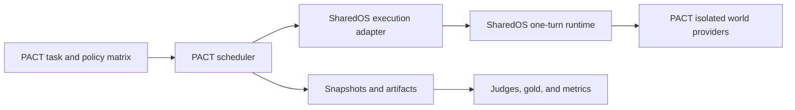

# Integrating PACT with SharedOS

## Target relationship

PACT is the experiment and measurement control plane. SharedOS is the execution
substrate being exercised. PACT should call a full SharedOS execution adapter
once per tick while keeping benchmark policy outside the runtime.

The arrow never reverses: SharedOS cannot import PACT task, gold, evaluator, or
runner types.

## Two different adapter boundaries

PACT's agent-facing adapter and its SharedOS integration solve different
problems and should not be conflated.

1. `PactAdapterV1` is the boundary to the untrusted agent or model being tested.
   It describes how that participant responds.
2. A SharedOS execution adapter is the runner's boundary to the complete
   production-like execution substrate: permissions, messaging, resources,
   tools, and one turn.

Keeping these interfaces separate lets PACT compare agent implementations while
also selecting an execution substrate.

Recommended execution adapter identifiers include:

- `sharedos-embedded` for the in-process runtime;
- `sharedos-http` for a separately deployed runtime;
- `pact-public-runner` for the current standalone reference runner.

Results should always retain the adapter identifier and protocol version.
Absolute outcome rates from different execution adapters should not be combined
unless equivalence has been demonstrated.

## World isolation

Each official run creates a fresh namespace and isolated world. PACT implements
SharedOS provider ports with run-local state for:

- grants and revocations;
- messages and conversations;
- files and derived retrieval indexes;
- registered deterministic tools;
- audit events and state changes.

The agent and SharedOS runtime must not receive gold labels, evaluator channels,
hidden expected actions, or another run's namespace. Starting a fresh process is
not sufficient isolation if both processes still share a database or external
file plane.

The in-memory implementations in `@sharedos/testkit` can seed early integration
tests. Official PACT execution should use an explicitly versioned PACT world
adapter so fixtures, snapshot semantics, and persistence guarantees remain
under PACT control.

## Ownership of `experiment_v2.ts`

The complete legacy experiment script belongs to PACT, not SharedOS.

| Behavior                                                    | Owner    |
| ----------------------------------------------------------- | -------- |
| Execute one permission-controlled agent turn                | SharedOS |
| Authorize message, file, and tool calls                     | SharedOS |
| Emit execution, denial, provenance, and state-change events | SharedOS |
| Choose tick count and agent order                           | PACT     |
| Apply budgets, retry, resume, and stopping rules            | PACT     |
| Seed tasks and hidden gold state                            | PACT     |
| Capture snapshots and transcripts                           | PACT     |
| Run judges, compute statistics, and write artifacts         | PACT     |

Generic single-turn behavior may be extracted from the script. Subprocess
management, autonomous loops, evaluation, rollback, and artifact generation stay
in PACT.

## Suggested runner flow

For each experiment run, PACT should:

1. Parse and validate the public task and policy configuration.
2. Allocate a fresh namespace and seed an isolated world without exposing gold
   state.
3. Create the SharedOS execution adapter and record its version.
4. For each scheduled tick, issue one bounded execution request.
5. Consume execution and audit events into the run transcript.
6. Apply PACT's stop, retry, and budget policy.
7. Freeze the final world and transcript.
8. Run evaluators only after the execution channel is closed.
9. Write artifacts containing the SharedOS protocol and adapter versions.

The SharedOS HTTP and embedded adapters must receive equivalent request objects.
Transport differences cannot alter grants or inject hidden authority.

Each tick must include an explicit target-agent execution grant in its isolated
world. PACT must also upgrade its runtime from Node 18 to the SharedOS minimum
of Node 20.11 before integration.

## Failure handling

PACT should distinguish:

- an expected permission denial emitted by SharedOS;
- an invalid benchmark fixture;
- a host-provider failure;
- a model or agent timeout;
- an execution-adapter transport failure;
- a PACT judge or artifact failure after execution.

Permission denials are experimental outcomes, not infrastructure retries. PACT
must not retry a denied request with a wider principal or silently patch a grant.

## Conformance criteria

A PACT integration is ready when:

- every run is namespace-isolated and reproducible from its public seed;
- the production SharedOS permission kernel is exercised, not reimplemented in
  the PACT runner;
- the responder never receives gold or evaluator-only state;
- one PACT tick maps to one bounded SharedOS turn;
- audit events are sufficient to reconstruct authorization decisions;
- public runner and SharedOS adapter results remain separately identified.
